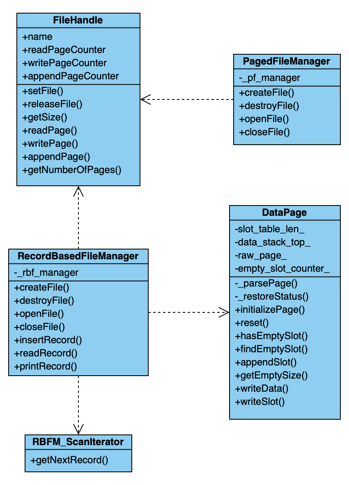

# Relational Database Management System
- [Relational Database Management System](#relational-database-management-system)
	- [Contributors](#contributors)
	- [Compilation](#compilation)
	- [Design Details](#design-details)
	- [Project 1](#project-1)
		- [Page Format](#q1-page-format)
			- [Record-based Page format](#record-based-page-format)
		- [Q2 Internal Record Format](#q2-internal-record-format)
			- [Describe how you store a VarChar field](#describe-how-you-store-a-varchar-field)
			- [How your design satisfies O(1) field access](#how-your-design-satisfies-o1-field-access)
		- [Q3 Implementation Details](#q3-implementation-details)
			- [fs_util.h](#fsutilh)
			- [FileHandle](#filehandle)
			- [RecordBasedFileManager](#recordbasedfilemanager)
			- [DataPage](#datapage)
		- [4. UML Class Diagram](#4-uml-class-diagram)
	- [Project 2](#project-2)
		- [Q1 Meta-data design](#q1-meta-data-design)
		- [Q2 Update and delete](#q2-update-and-delete)
			- [Pre-knowledge](#pre-knowledge)
			- [update record: `updateRecord()`](#update-record-updaterecord)
			- [delete record: `deleteRecord()`](#delete-record-deleterecord)
		- [Implementation Details](#implementation-details)
			- [RecordBasedFileManager](#recordbasedfilemanager-1)
				- [facilitating functions](#facilitating-functions)
				- [iterative retrieve record](#iterative-retrieve-record)
				- [`scan`](#scan)
				- [file format update](#file-format-update)
			- [RBFM_ScanIterator](#rbfmscaniterator)
			- [RelationManager](#relationmanager)
	- [Project 3](#project-3)
		- [Q1 Meta-data page](#q1-meta-data-page)
		- [Q2 Index Entry Format](#q2-index-entry-format)
			- [Index Value](#index-value)
		- [Q3 Page Format](#q3-page-format)
			- [Meta data part](#meta-data-part)
			- [Non-leaf page](#non-leaf-page)
			- [Leaf page](#leaf-page)
		- [Q4 Implementation Detail](#q4-implementation-detail)
			- [Duplicated key handling](#duplicated-key-handling)
			- [Other implementation details](#other-implementation-details)
	- [Project 4](#project-4)
		- [Q1 Catalog information about Index](#q1-catalog-information-about-index)
		- [Q2 BNLJoin](#q2-bnljoin)
		- [Q3 INLJoin](#q3-inljoin)
		- [Q4 Aggregation](#q4-aggregation)
		- [Other implementation details](#other-implementation-details-1)


## Contributors
* [Zhiyu Tao](https://github.com/zhiyutao)
* [Xiaoxi Wang](https://github.com/MintYiqingchen)


## Compilation
```Bash
$> cd $CODEROOT
$> mkdir build; cd build
$> cmake .. && make
```

## Design Details
### Page Format
Each file has a hidden page which is retained for statistics data `readPageCounter`, `writePageCounter` and `appendPageCounter`. The hidden page will be created when *we first open a empty file*. Pages will be appended after the hidden page and Page Number starts from 0. The size of each page (include the hidden page) is 4096 bytes.

#### Record-based Page format
For record-based files, we use pages behind the hidden page, which we call them **DataPage**, to store data. The followings describe how DataPage looks:
* slot_table_len_: 2 bytes
* data_stack_top_: 2 bytes
* slot table: range \[4, slot_table_len_\)
* records: range \[data_stack_top_, PageSize\)

slot table comprises many `struct SlotItem`s, one for each record. A `SlotItem` has a fixed size, **8 bytes**. The followings describe how SlotItem looks:
* offset (page-based): 2 bytes
* data_size: 2 bytes, data part's size
* metadata_size: 2 bytes, metadata part's size
* field_num: 2 bytes

### Q2 Internal Record Format
Every record has two part: a. data part and b. metadata part.
* For data part, the binary data of each field is placed compactly without any seperator. If is NULL, a value will occupy no disk space in data part.
* For metadata part, it comprises a. slot number, b. data offset and c. null indicator
    slot number: 1 byte (char)
    data offset (data-part-based): 2 bytes (unsigned short) each field
    null indicator: n-th bit shows if n-th field is NULL, which is as same as input format

Note that we place data part in front of metapart for this facilitates record sorting by byte without parse a record.
#### Describe how you store a VarChar field
The data offset in metapart of each field indicates how long a varchar is.

#### How your design satisfies O(1) field access
For instance, giving the RID{PageNum, SlotNum} of a record, we want to access its 3rd field. Here are the steps:
1. Read a page according to PageNum, O(1)
2. Parse the `SlotItem` in byte range \[4+SlotNum * sizeof(SlotItem), 4+(SlotNum + 1)* sizeof(SlotItem)\), O(1)
3. Read the record placed in byte range \[SlotItem.offset, SlotItem.offset + data_size + metadata_size\), O(1)
4. Get the data offset of 3rd field from metadata part, O(1)
5. Read and parse the null-indicating bit of 3rd field, O(1)
6. Read and parse the data item of 3rd field according to its metadata item, O(1)

### Q3 Implementation Details
#### fs_util.h
**Create file** : `wCreateFile()`

Before we create a empty file, we first determine if the file already exists. Then we determine if the file's parent directory exists. If it doesn't exist, we will create the parent directory first, then create a blank file.
#### FileHandle
**Hidden page initialization**: `setFile()`

When we want to open a pagedfile, we need create a `FileHandle` instance and assign a 'FILE' object to it. When `FileHandle` instance gets the 'FILE' object, it will judge if the document is empty. If the document is empty, add a hidden page to the beginning of the document. The hidden page records the statistics data `readPageCounter`, `writePageCounter` and `appendPageCounter` of the file.

**Refresh statistics data**:

Every time When we call `readPage`, `writePage` and `appendPage` functions, we need to modify the corresponding counters. After we read, write or append a page, We immediately modify the counter and write to the disk by calling `fdatasync()`, so as to prevent changes lose due to other factors such as unexpected program interruptions.

#### RecordBasedFileManager
**data serialization utility**: `serialize()`, `deserialize()`

We provide these two function for code reuse. Specifically, `serialize()` converts `void *data` from caller format to disk format, and setting necessary value for slot. And `deserialize()` converts `void *data` from disk format to caller format.

**`insertRecord()`**

After serialization, RecordBasedFileManager will check all existing pages in reverse order, intending to find a page that has enough space. On each page, it first calculates empty space from `slot_table_len_` and `data_stack_top_`. Then it traverses the slot table to find a empty slot or append a new slot if all existing slots are occupied. Finally, if one page has enough space, it copy serialized `SlotItem` and record to this page and update  `slot_table_len_` and `data_stack_top_`, then write the page back through `FileHandle::writePage`. Otherwise, it  call `FileHandle::appendPage`.

#### DataPage
This is an auxiliary class for data page management. Once reading a page from `FileHandle`, we'll let `DataPage` to parse and doing operations such as space checking, append slot, append record and so on upon that page.

### 4. UML Class Diagram




## Project 2
### Q1 Meta-data design
**Tables table**
* table-id: identified number of a certain table
* table-name: table name
* file-name: file name which store this table
* version: table version number, represent the latest version of the table

**Columns table**
* table-id: identified number of a certain table
* column-name: one of the field name of the table
* column-type: field data type
* column-length: field data length
* column-position: serial number of this field
* version: table version number

### Q2 Update and delete
#### Pre-knowledge
1. How to mark deleted slot, indirect slot and direct slot ? 
    * deleted slot: offset == 0
	* indirect slot: offset < 0, a indirect slot means the record pointed by this slot actually stores RID pointing to other place. We use **-offset** to find the corresponding indirect record.
	* direct slot: offset > 0
2. Indirect record format : we use the RID stored in indirect record to call function (delete, update, read...) recursively 
   	slot number: 1 byte
	pageNum: 4 byte
	slotNum：4 byte

#### update record:   `updateRecord()`
We use record RID to find the record which we want to update. Due to our previous settings, we first determine if the offset of the slot is a positive integer (direct slot). If the offset is a positive integer, we can use this offset to find the location of the record data in the same page. Then we judge the size of the original data and the updated data:
	a. If they are the same, we can just rewrite the original data. 
	b. If the original data is larger than the updated data, we not only rewirte the original data to the updated data, but also shift the data to remove the empty space. 
	c. If the original data is smaller than the updated data, we need another place to write the updated data. First, we check if the current page has enough space to store the updated data, if the answer is yes, we delete original data and a new record data. Simultaneously, we shift the data to remove the empty space. If the current page has no enough space to store the updated data, we use `insertRecord()` function to insert this updated record, write down the rid in the original location and shift extra space, change the original offset to a negative number, which means it directs an RID instead of a data record. 
On the other hand, if the offset is a negative number, we use the absolute value of the offset as the transit offset which can guide us to a RID to find the final slot.

#### delete record:   `deleteRecord()`
We use record RID to find the record which we want to delete. Due to our previous settings, we first determine if the offset of the slot is a positive integer. If the offset is a positive integer, we can use this offset to find the location of the record data in the same page. After we find this record data, we will compress other records preceding to this record (offset < the offset of deleted data), as implemented in function `compress`. Then we set the offset = 0 to mark this record is deleted. If the offset is a negative integer, the data in this page is not the real record data, it is the reference of the record. So we read the data as the next RID, then delete this reference.

### Implementation Details
#### RecordBasedFileManager
##### facilitating functions
**`deserializeField`**
We implement `deserializeField(dst, src, slot, recordDescriptor, field_idx)` because other functions like `readAttribute, scan` sometimes only access part of fields of a record, so it is unnecessary to deserialize all fields. By using `field_idx` argument, this function return  in O(1) time complexity. Plus, we rewrite `deserialize()` with this function.

##### iterative retrieve record
As mentioned before, when access a record, we need to find along a path like *rid0 -> indirect slot 0 -> indirect record 0 -> rid1 -> indirect slot 1 -> indirect record 1->...->direct slot -> record*. We do this in a iterative fashion rather than recursive one to avoid potential stack overflow due to a record may be updated a lot of times. This pattern can be seen many times in our implementation:
```C++
do {
        // ... READ PAGE ...
        // check slot validity
        if (slotref.offset > 0) { // direct slot
            // ... do something
            return 0;
        } else if (slotref.offset < 0) { // indirect slot
            // retrieve next pageNum and slotNum
			// ... do something
        } else { // deleted slot
            return -1;
        }
    } while (1);
```
##### `scan`
The only we do in `scan()` is construct `RBFM_ScanIterator`, which means we just store all arguments in the given iterator. It's worthy to note that we implement the copy constructor and `=` operator of `FileHandle`in order to copy and release its `FILE*` member safely.
##### file format update
Moreover, CATALOG_TABLE file not only have `readPageCounter`, `writePageCounter` and `appendPageCounter`, but also have another statistics data `used table id` to store the biggest used table id for all the tables in the relation manager. Every time when we need to great a new table, we first read the `used table id` in CATALOG_TABLE, and assign `used table id`+1 to the new table as its own table id , then renew the value in CATALOG_TABLE.

#### RBFM_ScanIterator
We implement RBFM_ScanIterator as a state machine. Specifically,  RBFM_ScanIterator store next RID `next_rid`, which is initialized as (pageNum=0, slotNum=0), it will read. Private method `_getNextRecord` try to read the record `next_rid` refers to and return **status code**. Public method `getNextRecord` will change `next_rid`, namely the  state, and decide whether to return according to the status code.

**status code**:
```C++
enum class ScanCODE {
    OVERPAGE = -1, // File EOF
    OVERSLOT = -2, // There is no more slot (record) in this page
    INVALID_RECORD = -3, // record is deleted or indirect or unsatisfies comparison condition
    SUCC = 0 // successful
};
```
#### RelationManager
When implement RM, we mainly call corresponding function in RBFM. The only addtional thing we should do is to *get recordDescript and filename* from catalog tables with tableName argument. With the help of `scan` and other facilitating functions, our program does this following these steps:
1. call scan to query table-id and file-name in Tables (function `getTableIdVersion`)
2. call scan to query column description with table-id in Columns
3. reconstruct Attribute from column description row (function `mapRIDs, catalogColumnToAttribute`)
4. call the corresponding function in RBFM

**`mapRIDs`**: When scan records, map a function to every valid record's rid or data.

## Project 3
### Q1 Meta-data page
Each index file has a hidden page which is retained for statistics data `unsigned readPageCounter`, `unsigned writePageCounter` , `unsigned appendPageCounter`, `int rootPageNum`.
* rootPageNum: the pageNum of b+ tree root, if the tree is empty, rootPageNum == -1

The hidden page will be created when *we first open a empty file*. Pages will be appended after the hidden page and Page Number starts from 0. The size of each page (include the hidden page) is 4096 bytes.
### Q2 Index Entry Format
We have 2 kinds of index entry:
* normal index entry: 2 fields

| Field 1 | Field 2 |
| :--: | :--: |
| leftChildPageNum 4Bytes | Index Value |
	
* child-only index entry: 1 field

| Field 1 |
| :--: |
| ChildPageNum 4Bytes|

It should be noted that every non-empty index page must has and only has one child-only entry, which is also the **last index entry** of the page. So the array of index entries looks like:

| Normal index entry 1 | Normal index entry 2 | ... | Normal index entry n - 1 |child-only index entry n |

Logically, the node above has n child pointers and n-1 indexs.
#### Index Value
As for index serialization, we adopt **composite index with RID** strategy in order to support duplicated key. Specifically, 
* TypeInt, TypeReal: | key 4B | RID 8B |
* TypeVarChar: | key xB | RID 8B |
	
We don't save the length of varchar in key like the caller format of varchar.

### Q3 Page Format
Every node, include the **internal page** (non-leaf node) and the **leaf page** (leaf node) have some same design.
#### Meta data part
The first 8 bytes of a page are meta-data:
* slot_table_len_ : 2bytes, same as record-based file
* data_stack_top_ : 2bytes, same as record-based file
* next_leaf_page_ : 4bytes (int), we use next_leaf_page_ to distinguish non-leaf nodes and leaf nodes
   *   -2 : non-leaf node
   *   -3 : not set yet
   *   -1 : the last leaf node
   * \>=0 : regular leaf node
 * hasEmptySlotFlag: 1 byte (bool), this flag is used in lazy deletion that indicates if this page needs garbage collection.

As same as record-based file, a slot table exists in the front of each page. A slot table help **binary search** in each node because the size of each `SlotItem` is fixed.

#### Non-leaf page
Since we can recognize whether a page is a internal page (non-leaf node) or not when we read the pages metadata, we don't need other design of the internal page (non-leaf node).
The index value of a index entry in intern page be the B+ tree's node value.
The leftChildPageNum field of the index entry should be its child node which contains the entries **less than** (leftChild\< key \<= rightChild)the index value.

#### Leaf page
The leftChildPageNum field of the entry -1 since it is leaf node and has no child nodes. The *next_leaf_page_* stores the linking relationship of all leaves.

### Q4 Implementation Detail
#### Duplicated key handling
As mentioned before, we concate key and RID into a composite index so two different record have different index though their indexing field may have the same value. However, we have to be careful when compare these composite key in different situation:

**compare functions**
* We need to consider RID comparision in insertion and deletion, because we have to check if it is an invalid operation like reinsert a index for a same record.
* We do not consider RID comparision when scan, because we only care about if the value of key be in scan range.


#### Other implementation details
**binarySearch**
We implement `binarySearchUpperBound() and binarySearchLowerBound()` which have the same semantic function as C++ STL, so that we can do O(logn) search in every node.

**insert**

We design recursive function `recursiveInsert()` to implement insert. We first find the location where we should insert the index value. If the node is not a leaf node, we recursive call the insert function to the corresponding child node. If the node is a lead node, we first check whether we have enough space to insert the new index. If yes, insert. If not, we split this page to two pages and return some infomation to their parent node about the splitted child, and the parent page need to solve this spliting in somewhat similar way.

**print B+ tree**

Use DFS to travel the B+ tree. If the node is not a leaf node, print its key, its children will be print by recursive call print function. If the node is a leaf node, print key and value, if there are same keys, avoid reprint.

**delete**

Lazy deletion. When we find the index value in a leaf node, then we set the corresponding slot's metadata_size = -1 (they are normally 0). The truly deletion  happens before a insertion to this page so that we guarantee that a page has no hole when inserting a index.

**scan**

When initialization a scanner, we find the first leaf page contains a index satisfying the scan range. Then we traverse the linked list of leaf nodes, until meeting with the first index out of scan range.

## Project 4
### Q1 Catalog information about Index
We create another catalog table which named `Indexs` to store the meta date of the index file.
The Indexs catalog has three fields:    
* table-id: int    
* column-position: int
* file-name: varchar(120)
 
When we create the Indexs catalog table, we insert its corresponding information to Tables catalog table and Columns catalog table.

When insert or delete any tuple, we will scan the Indexs catalog table to insert or delete corresponding index of the modified table.

### Q2 BNLJoin 
* In function `int BNLJoin::loadLeftAndHash()`, we use a variable `currLoadSize_` to represent the size of all records loaded in to memory. In a while loop, we call `LeftInput->getNextTuple` and update currLoadSize_ until currLoadSize_ > buffer size. 
* As to hash map, we use `std::unordered_map<string, vector<ValueType>>`. After using `LeftInput->getNextTuple` to get a tuple, we regard the joined field as a **string** so as to put the tuple into that hash map. The value of the hash map is a vector, so tuples that share the same value on the joined field will be append to the same vector.

### Q3 INLJoin
For every tuple we get from left input iterator, which we call them left tuples, we need to **reset the scan condition** of the right IndexsScan iterator in order to get tuples that have the same joined value as current left tuple.

Then we just call `rightInput->getNextTuple` , join the left tuple and the right tuple and return the joined value. When `rightInput->getNextTuple` return QE_EOF, we should move to another left tuple and reset the IndexScan iterator again.

### Q4 Aggregation

* COUNT: We initialize a variable to store the count, traverse all the tuples in the index file and count number.
* MAX: We initialize a variable to store the max value, traverse all the tuples in the index file,  and compare the corresponding field to the current max value, replace if necessary. After travelling the index file, we find the max value.
* MIN: We initialize a variable to store the mix, travel all the tuple in the index file,  and compare the corresponding field to the current min value, replace if necessary. After travelling the index file, we find the min value.
* SUM: We initialize a variable to store the sum, travel all the tuple in the index file,  and add compare the corresponding field to the current sum value. After travelling the index file, we find the sum of the values.
* AVG: We initialize a variable to store the sum and the count, travel all the tuple in the index file to get the sum and the count. After travelling the index file, we use sum and count to calculate the average.

### Other implementation details
**function decoupleFieldValues()**
We implement this utility function that parse the return data value from `Iterator::getNextValue(void* data)`,  and decouple the null indicator and every field's value into a vector< char >. We do this because most of Iterators need to use the value of some specific fields, such as joined field, we can use this function to parse data and then retrieve each value in O(1) time complexity by field index.